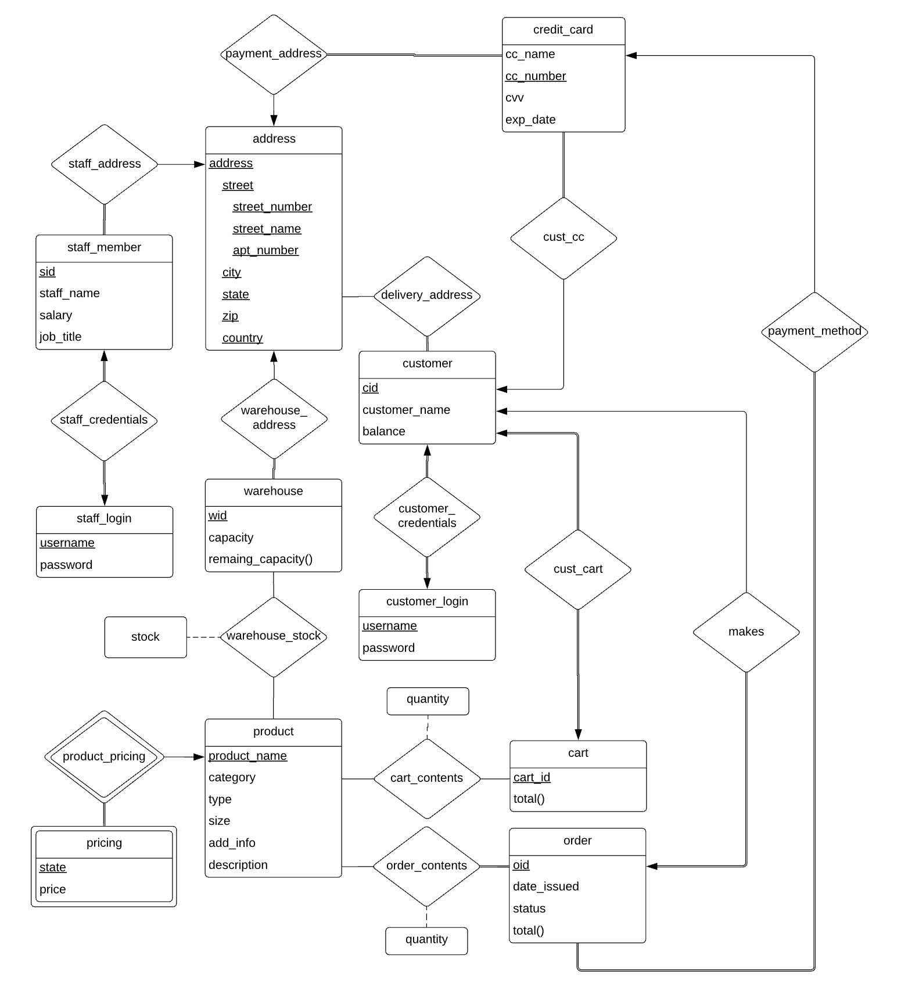
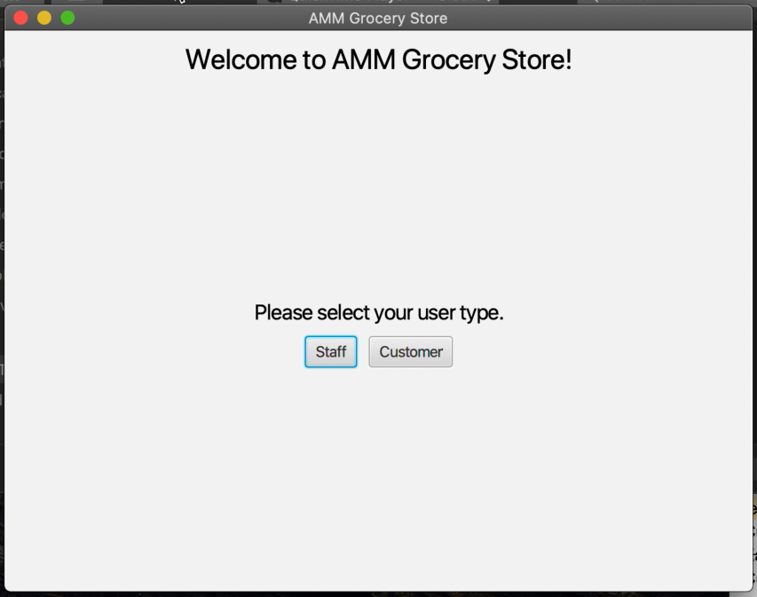
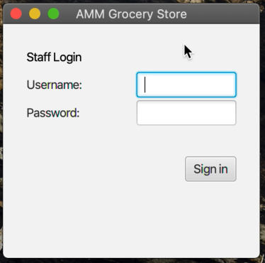
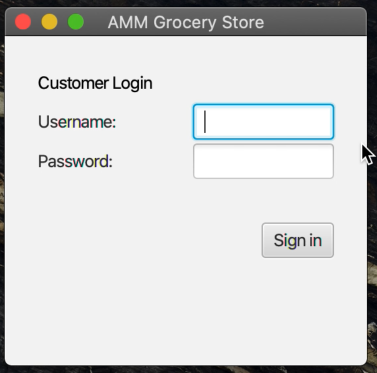
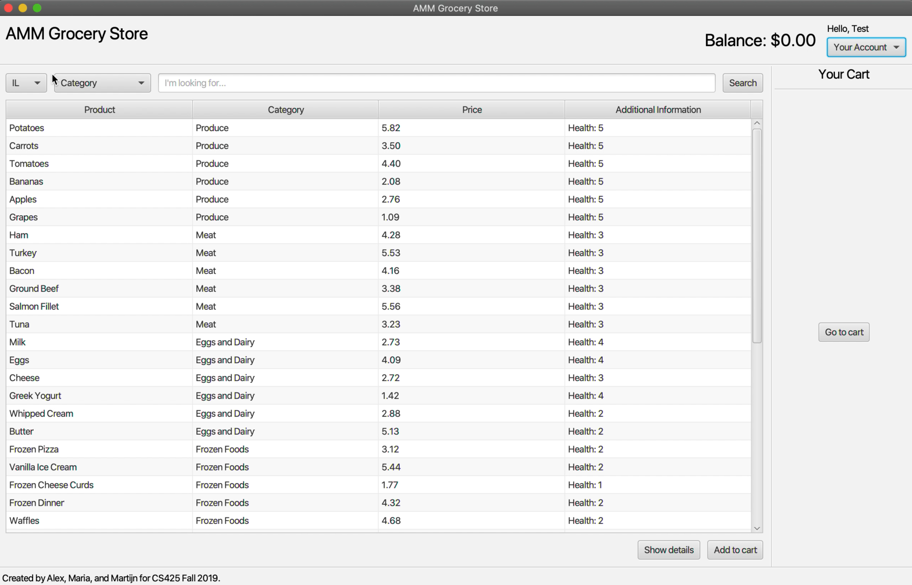
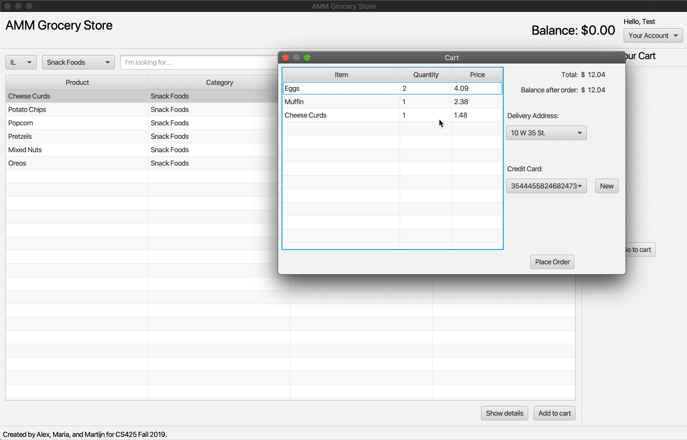
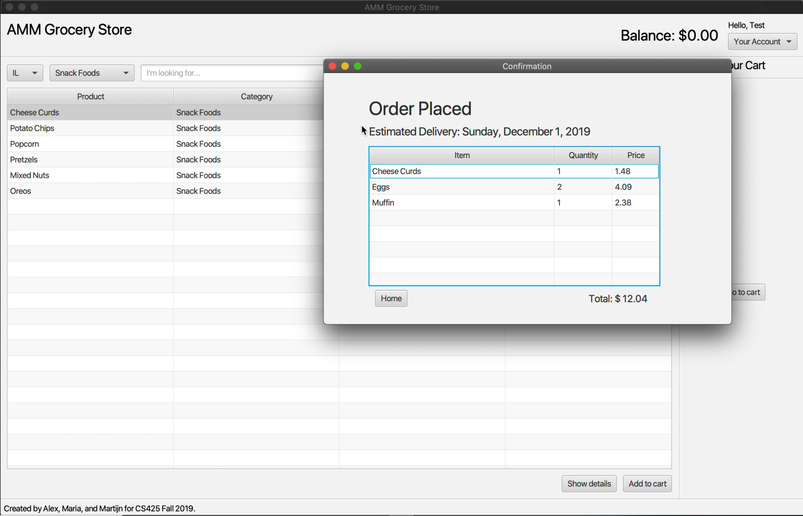
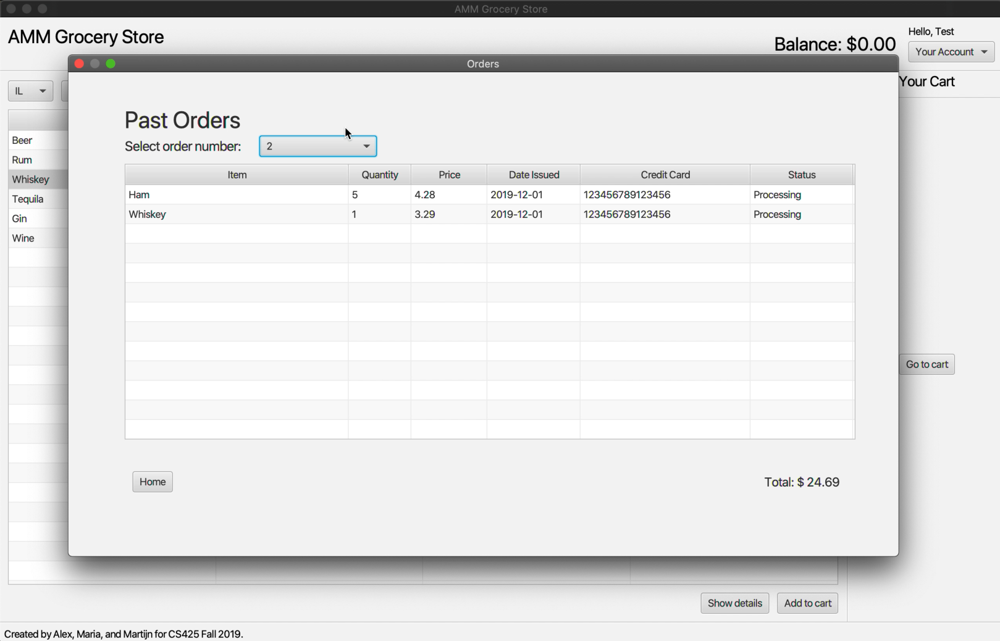

# Grocery Store
> A grocery database management application using Java, JDBC, and PostgreSQL.

## Table of contents
* [General Info](#general-info)
* [Screenshots](#screenshots)
  * [Development process](#development-process)
  * [Final application](#final-application)
* [Technologies](#technologies)
* [Setup](#setup)
  * [How to play](#how-to-play)
  * [How to work with this Unity project](#how-to-work-with-this-unity-project)
* [Features](#features)
* [To-do List](#to-do-list)
* [Status](#status)
* [Author](#author)

## General Info
The goal of this project was to build a grocery store application using a database backend to store information about products, availability of products in the stock, and customers of the store. Customers of the store were supposed to be able to search for products and look up information about products, setup an account and change their preferences and account details, order products, and make payments.

Our group began this project by writing down all of the information we needed to describe a grocery store and its users. Following that, we developed an [entity–relationship model](https://en.wikipedia.org/wiki/Entity%E2%80%93relationship_model) (ER model) that included the information we needed in an efficient manner. Then, we started working on our relational schema, which would be translated into an actual SQL script to create the tables and constraints using [PostgreSQL](https://www.postgresql.org/ "PostgreSQL: The world's most advanced open source database"). Finally, we worked on incorporating our database into our graphical user interface made with [JavaFX](https://openjfx.io/ "JavaFX").

## Screenshots
Here are some images from the development process and some screenshots of the final application. You can also download [these videos](./Videos) to view the application in action (unfortunately, the videos are too large to preview on Github).

### Development process
#### ER model

### Final application
#### Login

#### Store page

## Technologies
* [Unity 2018.4.25f1](https://unity3d.com/unity/qa/lts-releases "LTS Releases - Unity")
* C# 4.0

## Setup
### How to play
You can go [here](https://connect.unity.com/mg/other/street-runner-prototype-3 "Street Runner (Prototype 3) - Unity Connect") to play the WebGL version of the game online from the Unity Connect website.

### How to work with this Unity project
You can view the code [here](./Assets/Scripts). To work with this project, you can follow the instructions on the [main README.md](../README.md#how-to-work-with-the-unity-projects).

## Features
* Infinite side scroll
* Random obstacle spawning
* Score UI
* Double jump
* Super speed ability
* Intro walk in animation
* Restart button

## To-do List
* Increase obstacle spawn rate when dashing
* Increasing difficulty over time
* Muffle music on death
* Starting music (street sounds maybe)
* And many other possiblities...

## Status
Project is: _finished_

## Author
Created by Alex Riegler.
